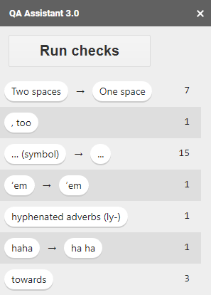

# QA Assistant

 

The QA Assistant is a tool to make the process of QAing a novel or other piece of writing easier. This add-on displays common proofreading-related issues and errors, along with the number of occurrences of each issue. Whenever possible, it provides regexes which you can use to search your document for said issues. 

**It does:**
* Check for common typos (e.g. woah -> whoa)
* Check for common punctuation-related errors (e.g. two spaces in a row)
* Check for commonly confused words (e.g. discrete vs discreet)
* Prefer Merriam-Webster's spellings
* Prefer American spellings in general

**It does not:**
* Make changes for you
* Alter your document in any way
* Store any of your data
* View any of your data, apart from the document which it's checking

This is a **personal project** for which I am not being paid, and is offered free of charge. Please view the privacy policy and terms of service for use of the tool below.

If you like this tool, consider dropping a [donation](https://ko-fi.com/shinotype) to say thank you!

* [Privacy Policy](privacy.html)
* [Terms of Service](terms.html)
* [Contact the developer](.../support.html)